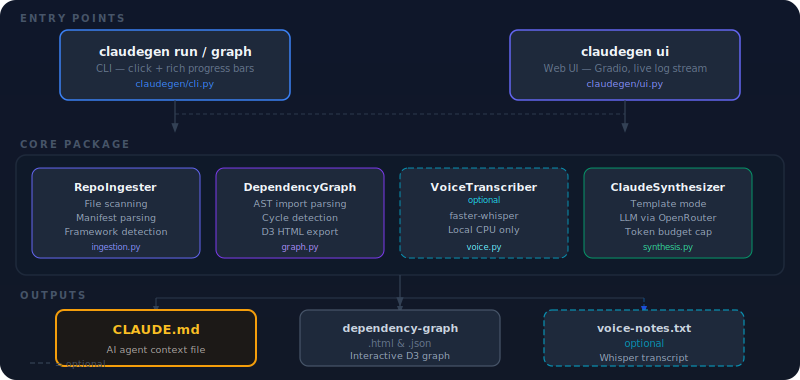
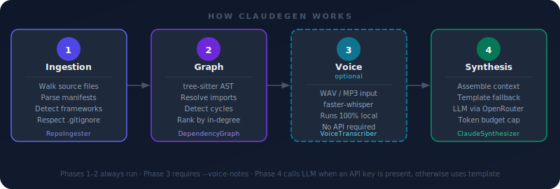

# ClaudeGen

**Automatically generate CLAUDE.md files for any code repository.**

ClaudeGen scans your codebase, builds a dependency graph, and optionally transcribes voice notes to produce a dense, agent-optimized `CLAUDE.md` that tells AI coding tools which files matter most, what the architecture looks like, and what to avoid.

---

<div align="center">

**Built entirely by [NEO](https://heyneo.com) — Your fully autonomous AI Engineering Agent**

[](https://marketplace.visualstudio.com/items?itemName=NeoResearchInc.heyneo)

</div>

---



## Requirements

- Python **3.11+** (uses stdlib `tomllib`)
- No GPU needed — all local inference runs on CPU

## Installation

```bash
# Clone the repository
git clone https://github.com/your-org/claudegen
cd claudegen

# Create a virtual environment (recommended)
python3 -m venv .venv
source .venv/bin/activate   # Windows: .venv\Scripts\activate

# Install
pip install -e .

# Install with test dependencies
pip install -e ".[test]"
```

## Configuration

### API Key (optional — required for LLM-enhanced output)

Without a key ClaudeGen still works — it falls back to template-based generation.

```bash
# OpenRouter (recommended)
export OPENROUTER_API_KEY=sk-or-v1-your-key-here

# Or Anthropic directly
export ANTHROPIC_API_KEY=sk-ant-your-key-here
```

Get an OpenRouter key at: https://openrouter.ai/settings/keys

## CLI Usage

### Generate CLAUDE.md

```bash
# Basic — writes CLAUDE.md inside the target repo
claudegen run /path/to/your/repo

# Custom output path
claudegen run /path/to/repo --output docs/CLAUDE.md

# Dry run — print to stdout, write nothing
claudegen run /path/to/repo --dry-run

# With a pre-recorded voice note (WAV or MP3)
claudegen run /path/to/repo --voice-notes /path/to/notes.wav

# Adjust token budget (default 4000)
claudegen run /path/to/repo --token-budget 6000

# Use a different LLM model via OpenRouter
claudegen run /path/to/repo --model anthropic/claude-opus-4-6

# Limit how many source files to scan (default 1000)
claudegen run /path/to/repo --max-files 500
```

### Generate Dependency Graph Only

```bash
# Write graph files to current directory
claudegen graph /path/to/repo

# Write to a specific directory
claudegen graph /path/to/repo --output-dir ./graphs
```

Output:
- `dependency-graph.html` — Interactive D3.js force-directed graph (open in browser)
- `dependency-graph.json` — Raw graph data (nodes, edges, in-degree, cycle flags)

### Launch the Web UI

```bash
claudegen ui

# Custom host/port
claudegen ui --host 0.0.0.0 --port 8080
```

Open http://localhost:8080 in your browser.

## CLI Reference

### `run` options

| Option | Default | Description |
|--------|---------|-------------|
| `--output, -o` | `<repo>/CLAUDE.md` | Output file path |
| `--max-files, -m` | `1000` | Maximum source files to scan |
| `--voice-notes, -v` | None | Path to a WAV/MP3 audio file for transcription |
| `--model` | `anthropic/claude-sonnet-4-6` | LLM model via OpenRouter |
| `--token-budget` | `4000` | Max tokens in the generated CLAUDE.md |
| `--dry-run` | False | Print to stdout, don't write files |

### `graph` options

| Option | Default | Description |
|--------|---------|-------------|
| `--output-dir, -d` | `.` | Directory to write graph files |
| `--max-files, -m` | `1000` | Maximum source files to scan |

### `ui` options

| Option | Default | Description |
|--------|---------|-------------|
| `--host` | `127.0.0.1` | Host to bind to |
| `--port` | `8080` | Port to listen on |

## What Gets Generated

Running `claudegen run` creates:

| File | Description |
|------|-------------|
| `<repo>/CLAUDE.md` | Main documentation at repo root |
| `<repo>/.claude/dependency-graph.html` | Interactive D3.js graph |
| `<repo>/.claude/dependency-graph.json` | Raw graph data |
| `<repo>/.claude/voice-notes.txt` | Transcribed voice input (if `--voice-notes` was used) |

### CLAUDE.md sections

```markdown
# <project name>

## Project Overview
<first paragraph of README, or fallback description>

## Technology Stack
<detected frameworks (FastAPI, Next.js, …) + languages>

## Entry Points
<main.py, app.py, index.ts, server.js — whichever exist>

## Key Files (start here)
Files ranked by import frequency from the dependency graph:
1. `app/core/config.py` — imported by 5 files
2. `app/db/session.py` — imported by 3 files
...

## Dependencies
<parsed from pyproject.toml / package.json / requirements.txt>

## Circular Dependencies (Fix These)
<only appears when cycles are detected>
- a.py → b.py → c.py

## Team Notes (from voice)
<only appears when --voice-notes was provided>
```

## How It Works



### Pipeline

1. **Ingestion** (`RepoIngester`)
   - Walks the directory tree, skipping `node_modules`, `.git`, `__pycache__`, `.venv`, `dist`, `build` and other non-source dirs
   - Respects `.gitignore` via `gitignore-parser` (if present)
   - Parses manifests: `pyproject.toml`, `requirements.txt`, `package.json`, `go.mod`, `Cargo.toml`
   - Detects frameworks by checking manifest dependencies (FastAPI, Flask, Django, Next.js, Express, NestJS, React, Vue, Angular, Svelte, Nuxt, …)
   - Identifies entry points: `main.py`, `app.py`, `server.py`, `index.ts`, `server.js`, etc.
   - Reads `README.md` for the project description

2. **Dependency Graph** (`DependencyGraph`)
   - Uses tree-sitter (Python + JavaScript + TypeScript grammars) to extract imports from every source file
   - Resolves internal imports to actual file paths — `from app.core.config import settings` becomes an edge to `app/core/config.py`, not an external node
   - Handles JS/TS relative imports (`./utils`, `../lib/db`) and scoped packages (`@angular/core`)
   - Builds a NetworkX `DiGraph`; detects cycles with `nx.simple_cycles()`
   - Ranks internal files by in-degree (most imported = most critical)
   - Exports interactive D3.js HTML + JSON

3. **Voice Transcription** (`VoiceTranscriber`)
   - Accepts a pre-recorded WAV or MP3 file via `--voice-notes`
   - Transcribes locally with `faster-whisper` (`base.en` model, CPU, int8) — no audio leaves your machine
   - Transcript is injected into the CLAUDE.md as team notes

4. **Synthesis** (`ClaudeSynthesizer`)
   - Assembles repo summary, graph rankings, and voice notes into a structured prompt
   - If `OPENROUTER_API_KEY` or `ANTHROPIC_API_KEY` is set: calls Claude via OpenRouter for richer, LLM-generated sections
   - Without a key: generates from a structured template (still useful)
   - Respects the `--token-budget` cap

## Web UI

The Gradio interface (http://localhost:7860) has three columns:

- **Left — inputs**: repo path, audio file upload (WAV/MP3) for voice notes, token budget slider, max-files slider, model name
- **Center — log**: live progress stream showing each phase as it runs
- **Right — output**: generated CLAUDE.md with copy button, download button, and embedded D3.js dependency graph

## Dependencies

All installed automatically via `pip install -e .`:

| Package | Purpose |
|---------|---------|
| `click` | CLI framework |
| `rich` | Terminal progress bars and formatting |
| `networkx` | Graph construction, cycle detection, in-degree ranking |
| `tree-sitter` + grammars | AST-level import extraction (Python, JS, TS) |
| `faster-whisper` | Local voice transcription (CPU, no API) |
| `openai` | OpenRouter API client (OpenAI-compatible) |
| `gradio` | Web UI |
| `gitignore-parser` | Respects .gitignore during file walking |

## Testing

```bash
pytest tests/ -v
```

Tests cover ingestion, import extraction, graph construction and cycle detection, synthesis template, and voice transcription.

## Adding Support for New Languages

1. Install the tree-sitter grammar: `pip install tree-sitter-<language>`
2. Add file extensions to `LANGUAGE_MAP` in `ingestion.py`
3. Add import extraction logic to `DependencyGraph` in `graph.py`
4. Add any manifest parser to `ingestion.py` if the language has one
5. Run `pytest tests/test_graph.py -v` to verify

## Troubleshooting

### `OPENROUTER_API_KEY not set`
ClaudeGen falls back to template mode — you still get a valid CLAUDE.md, just without LLM enrichment. Set the key and re-run for better output.

### `ModuleNotFoundError: No module named 'claudegen.graph'` (or similar)
You're not running from the project directory or the venv isn't activated:
```bash
cd /path/to/claudegen
source .venv/bin/activate
pip install -e .
```

### Tree-sitter grammar not found
```bash
pip install tree-sitter-python tree-sitter-javascript tree-sitter-typescript
```

### Voice transcription fails
- The `--voice-notes` flag takes a **file path** (pre-recorded WAV or MP3), not live mic input
- Check the file exists and is a valid audio file
- `faster-whisper` downloads the `base.en` model on first run (~150 MB) — ensure you have internet access the first time

### Gradio UI won't start
```bash
# Port in use?
claudegen ui --port 8081

# Missing gradio?
pip install gradio
```

## License

MIT
